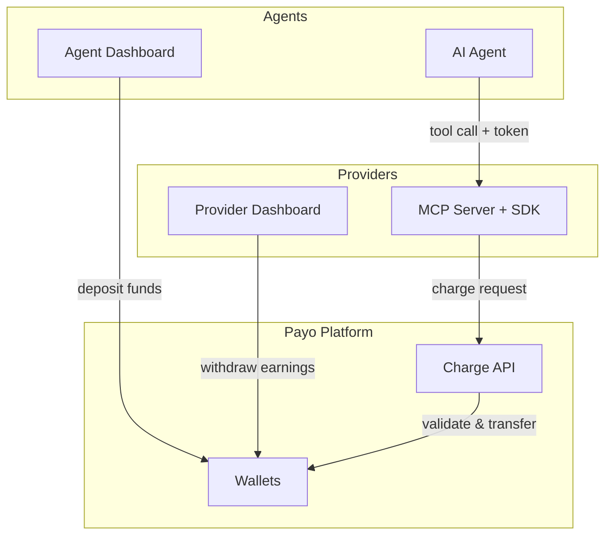

## Architecture Overview

Payo sits between AI agents and MCP tool providers, handling authentication, charging, and settlement.



## The Charge Flow

When an agent calls a paid tool, here's what happens:

<Steps>
  <Step title="Agent sends tool call">
    The agent's MCP client sends a `tools/call` request to the provider's server. The request includes the agent's token in the `Authorization` header.
  </Step>
  <Step title="SDK intercepts the call">
    The `withPayments()` wrapper intercepts the request before the tool executes.
  </Step>
  <Step title="SDK checks pricing">
    The SDK looks up the tool's price. If price is `0`, the tool executes immediately (no charge).
  </Step>
  <Step title="SDK charges the agent">
    For paid tools, the SDK calls the Payo platform with the agent token, tool name, and price.
  </Step>
  <Step title="Platform validates and transfers">
    Payo validates both keys, checks the agent's balance, and transfers funds from the agent to the provider.
  </Step>
  <Step title="Tool executes">
    If the charge succeeds, the tool runs and returns its result to the agent.
  </Step>
</Steps>

## Atomic Transactions

Every charge is atomic and uses double-entry bookkeeping:

- The agent's credits are debited
- The provider's earnings are credited
- Both entries are recorded in the ledger

This ensures money is never created or destroyed, every transaction is logged, and partial transfers are impossible.

## Authentication

Payo uses two types of keys:

| Key Type | Format | Used By | Purpose |
|----------|--------|---------|---------|
| **Agent Token** | `sk_live_...` | Agents | Identifies who's being charged |
| **Provider Key** | `sk_live_...` | Providers | Authenticates charge requests |

<Note>
Keys are stored securely as hashes. The raw key is shown once at creation and cannot be retrieved again.
</Note>

## Transport Support

The SDK extracts agent tokens from:

<Tabs>
  <Tab title="HTTP Transport">
    ```
    Authorization: Bearer sk_live_xxx
    ```
    Standard HTTP header. Used by most MCP clients.
  </Tab>
  <Tab title="stdio Transport">
    ```bash
    AGENT_TOKEN=sk_live_xxx npx my-mcp-server
    ```
    Environment variable. Used when MCP runs as a subprocess.
  </Tab>
</Tabs>

## Error Handling

When a charge fails, the tool **never executes**. This protects both parties:

| Error | Meaning | Resolution |
|-------|---------|------------|
| `TOKEN_MISSING` | No agent token provided | Agent must configure their token |
| `TOKEN_INVALID` | Token doesn't exist or is deleted | Agent must get a new token |
| `INSUFFICIENT_BALANCE` | Agent doesn't have enough credits | Agent must deposit more funds |
| `PLATFORM_UNAVAILABLE` | Payo platform is down | Retry later (or use `failOpen`) |

## Security

- **Charge-before-execute**: Tools only run after successful payment
- **Scoped keys**: Agent and provider keys have separate permissions
- **No stored secrets**: Raw keys are never stored, only secure hashes
