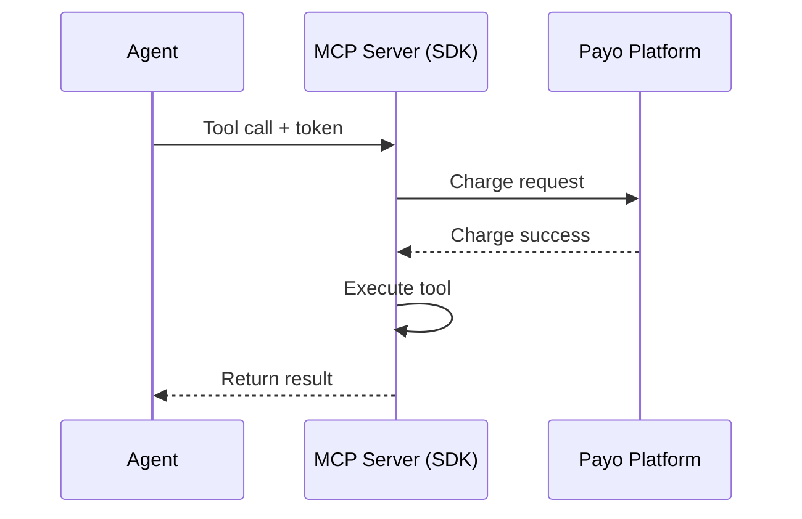

Payo enables **micropayments between AI agents and MCP tool providers**. Agents pay per tool call, providers earn revenue automatically.

<CardGroup cols={2}>
  <Card title="I'm building an AI Agent" icon="robot" href="/quickstart-agent">
    Learn how to enable your agent to use paid MCP tools
  </Card>
  <Card title="I'm an MCP Provider" icon="server" href="/quickstart-provider">
    Learn how to monetize your MCP tools
  </Card>
</CardGroup>

## The Problem

MCP (Model Context Protocol) lets AI agents use external tools. But there's no built-in way for providers to charge for their tools, or for agents to pay.

**For providers:** You've built valuable MCP tools but can't monetize them.

**For agents:** You want to use premium tools but there's no payment mechanism.

## How Payo Works

<Steps>
  <Step title="Providers wrap their MCP server">
    Add `withPayments()` from the Payo SDK to enable charging. Define prices per tool.
  </Step>
  <Step title="Agents get a token">
    Sign up at payo.dev, deposit credits, and get an agent token.
  </Step>
  <Step title="Agents call tools">
    When an agent calls a paid tool, Payo automatically charges their balance and credits the provider.
  </Step>
</Steps>

## Key Concepts

<AccordionGroup>
  <Accordion title="Agent Token">
    A secret key (`sk_live_...`) that identifies the agent making tool calls. Agents pass this token when calling MCP tools. Each call is charged to the agent's balance.
  </Accordion>
  <Accordion title="Provider API Key">
    A secret key that providers use to authenticate with the Payo platform. Used server-side in the SDK configuration.
  </Accordion>
  <Accordion title="Pricing">
    Providers set a USD price for each tool. Example: `{ "get_weather": 0.01, "analyze_image": 0.05 }`. Free tools can have price `0`.
  </Accordion>
  <Accordion title="Wallets">
    Agents have a **credits balance** (deposited funds). Providers have an **earnings balance** (revenue earned). Payo handles the transfer automatically.
  </Accordion>
</AccordionGroup>

## Next Steps

<CardGroup cols={2}>
  <Card title="Agent Quickstart" icon="rocket" href="/quickstart-agent">
    Get started in 5 minutes
  </Card>
  <Card title="Provider Quickstart" icon="code" href="/quickstart-provider">
    Start earning in 10 minutes
  </Card>
  <Card title="How It Works" icon="diagram-project" href="/how-it-works">
    Deep dive into the architecture
  </Card>
  <Card title="SDK Reference" icon="book" href="/sdk/overview">
    Full API documentation
  </Card>
</CardGroup>
