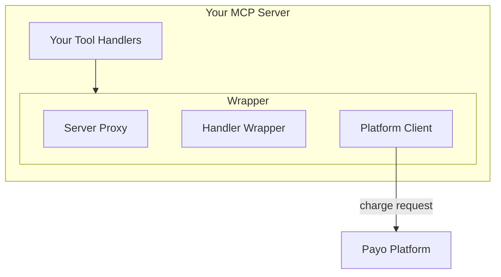

The Payo SDK enables MCP tool providers to charge for tool calls. Wrap your server with `withPayments()` and the SDK handles authentication, charging, and error handling automatically.

## Installation

<Tabs>
  <Tab title="npm">
    ```bash
    npm install @payo/mcp
    ```
  </Tab>
  <Tab title="pnpm">
    ```bash
    pnpm add @payo/mcp
    ```
  </Tab>
  <Tab title="yarn">
    ```bash
    yarn add @payo/mcp
    ```
  </Tab>
</Tabs>

## Requirements

- **Node.js 18+**
- **@modelcontextprotocol/sdk** - The MCP SDK (peer dependency)
- **Provider API key** - From your Payo dashboard

## Quick Example

```typescript
import { McpServer } from '@modelcontextprotocol/sdk/server/mcp.js';
import { withPayments } from '@payo/mcp';

const server = new McpServer({ name: 'my-api', version: '1.0.0' });

const paidServer = withPayments(server, {
  apiKey: process.env.PAYO_API_KEY!,
  pricing: {
    'paid_tool': 0.05,
    'free_tool': 0,
  }
});

paidServer.tool('paid_tool', { /* schema */ }, async (args) => {
  // Executes only after successful charge
  return { result: 'data' };
});
```

## Exports

The SDK exports the following:

### Main Function

| Export | Description |
|--------|-------------|
| `withPayments()` | Wraps an MCP server with payment logic |

### Types

| Export | Description |
|--------|-------------|
| `PaymentConfig` | Configuration options for `withPayments()` |
| `PricingConfig` | Tool name → USD price mapping |
| `PaymentError` | Error class for payment failures |
| `PaymentErrorCode` | Enum of error codes |
| `LogLevel` | Logging verbosity levels |
| `ErrorVerbosity` | `'detailed'` or `'concise'` |

### Utilities

| Export | Description |
|--------|-------------|
| `PlatformClient` | Direct access to Payo API (advanced) |
| `SessionManager` | Token extraction utilities (advanced) |

## TypeScript Support

The SDK is written in TypeScript with full type definitions:

```typescript
import type {
  PaymentConfig,
  PricingConfig,
  PaymentError,
  PaymentErrorCode
} from '@payo/mcp';
```

## Architecture



The SDK:
1. **Proxies** your server to intercept handler registration
2. **Wraps** tool handlers with payment logic
3. **Calls** the Payo platform API for charges
4. **Executes** your handler only after successful payment

## Next Steps

<CardGroup cols={2}>
  <Card title="withPayments()" icon="code" href="/sdk/with-payments">
    Full API documentation
  </Card>
  <Card title="Configuration" icon="gear" href="/sdk/configuration">
    All configuration options
  </Card>
  <Card title="Error Codes" icon="triangle-exclamation" href="/sdk/errors">
    Error types and handling
  </Card>
  <Card title="Examples" icon="book-open" href="/sdk/examples">
    Complete code examples
  </Card>
</CardGroup>
